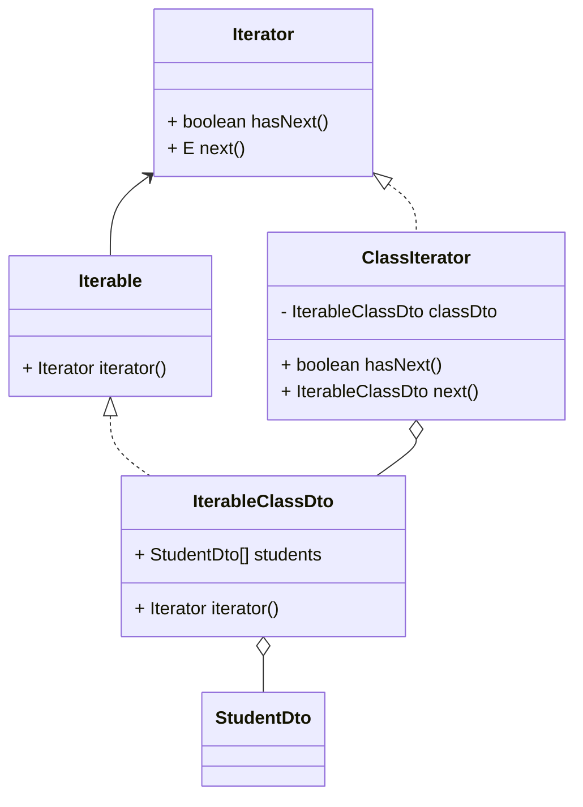

# designpattern

デザインパターンを実装してみるパッケージです。

実装内容の概要を記載します。

- [designpattern](#designpattern)
  - [iterator](#iterator)

## iterator

クラスDTOとして生徒情報DTOをまとめている。クラスDTOをIterableにして、イテレーターで生徒情報を取り出せるように実装した。

java.lang.Iterator、java.lang.Iterableを利用する。イテレーターに関連するメソッド、フィールドしか記述していない。

- 概要
  - StudentDto：生徒情報DTO。
  - IterableClassDto：クラス情報DTO。複数の生徒情報をフィールドに持つ。Iterableを継承している。
  - ClassIterator：クラス情報DTOのイテレーター。Iteratorを継承している。
